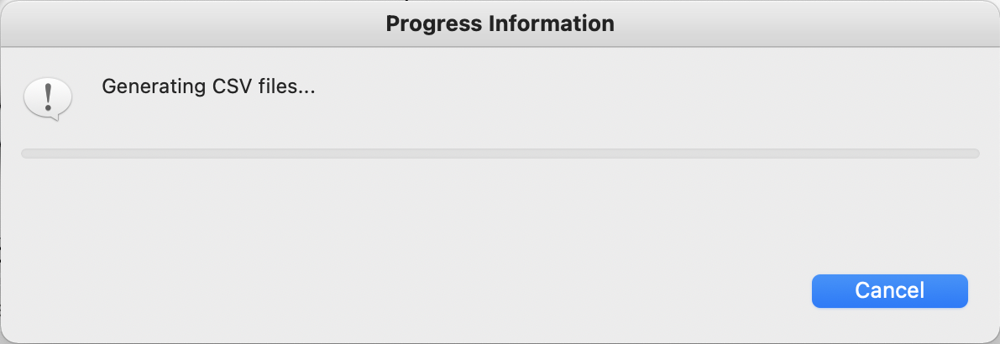

= Export du méta-modèle Capella

== Définition

Cette action permet d'exporter le méta-modèle Capella vers un fichier CSV. Il contient les 4 colonnes suivantes :

* class_name : le nom de la classe Capella,
* feature_type : « attribute » si c'est un attribut ou « reference » si c'est une référence,
* feature_name : le nom de l'attribut ou de la référence,
* attribute_type : le type de l'attribut.

Le fichier contient 1 ligne par attribut/reference.

Il contient aussi les catégories de la vue Semantic Browser comme références.

Ce fichier a été généré pour l'implémentation de l'add-on de conversion Capella vers Neo4J en python.

== Export

=== Activation de l'action

Pour activer cette action, il faut ajouter *-Dconversion.capella.metamodel=true* dans le fichier *eclipse.ini* situé dans le répertoire d'installation de Capella.

=== Action

Pour exporter le méta-modèle Capella vers un fichiers CSV, il suffit de faire un clic-droit sur un projet Capella et de sélectionner le menu *Capella Conversion > Generate Capella Metamodel file*. 

Une boîte de dialogue s'ouvre alors, vous permettant de configurer l'export :

[width=400]
image::images/capellatocsv_dialog.png[Capella vers CSV]

Les paramètres d'export sont :

* le répertoire d'export (_Export directory_) : répertoire qui va contenir le fichier CSV suite à l'export. Un message d'erreur s'affiche si le répertoire sélectionné n'existe pas.
* le délimiteur de champ (_Field delimiter_) : chaque cellule d'un fichier CSV est séparée par un délimiteur spécifique, représenté par un caractère. Les valeurs les plus courantes sont le point-virgule, la virgule, l'espace et la tabulation. Le champ _Other:_ permet toutefois de définir le caractère de votre choix.
* le délimiteur de texte (_Text delimiter_) : chaque cellule d'un fichier CSV est entourée par un délimiteur de texte, représenté par un caractère. Les valeurs possible sont les guillemets (_double quotation marks_), les guillemets simples (_single quotation marks_), ou aucun délimiteur (_none_).
* le jeu de caractères (_Character set_) : le jeu de caractères (i.e. encodage) à utiliser pour les fichiers CSV. Les valeurs possibles sont windows-1252 (aussi connu sous le nom de _Cp1252_), UTF-8, ou ISO-8859-1 (aussi connu sous le nom de _Latin-1_).
* le séparateur de ligne (_Line separator_) : le séparateur de ligne à utiliser dans les fichiers CSV. Les valeurs possibles sont le séparateur de ligne de Windows (_CRLF_), celui d'Unix (_LF_) ou celui du système d'exploitation sur lequel est exécuté l'export.

Tous ces paramètres ont pour valeur par défaut les valeurs définies dans les link:preferences.html[préférences].

Le bouton _Restore Defaults_ permet d'appliquer les valeurs par défaut.

Le bouton _Cancel_ permet d'annuler le paramétrage de l'export (i.e. de fermer la boîte de dialogue).

Le bouton _Export_ permet d’exécuter l'export avec les paramètres définis.

Une fois le processus de conversion lancé, il est possible d'annuler la conversion en appuyant sur le bouton _Cancel_ :

[width=400]

== Messages d'erreurs

=== Session fermée

L'export ne peut fonctionner que si la *session Capella est ouverte*, sans quoi un message d'erreur apparaîtra :

[width=450]
image::images/capellatocsv_session_closed.png[Capella session fermée]

Pour ouvrir la session Capella, veuillez double cliquer sur le fichier *.aird* contenu dans le projet.
