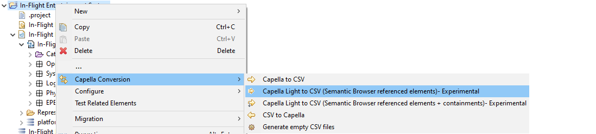
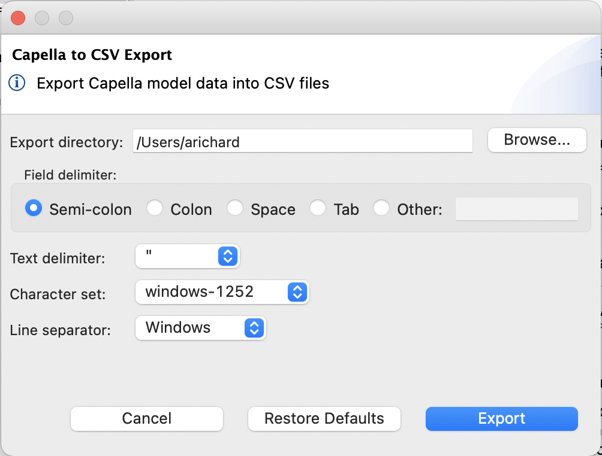
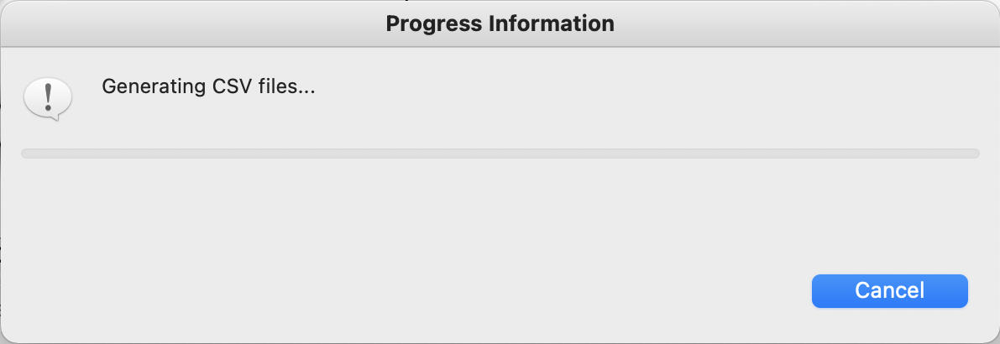
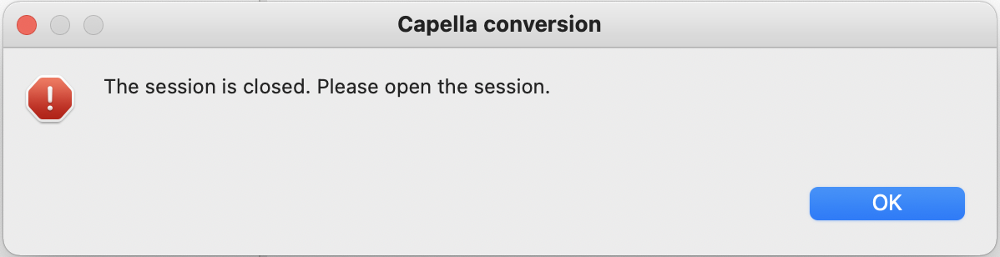
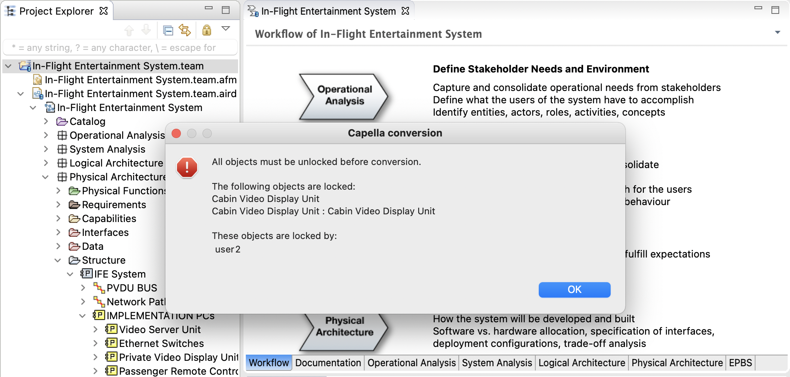

= Capella light vers CSV (Expérimental)

== Définition

Cette conversion permet d'exporter *une partie* du modèle Capella vers des fichiers CSV. Cet export contient les éléments suivants :

* l'arborescence structurelle du modèle : système, blocs d'architecture et packages,
* tous les éléments référencés par les liens de la vue Semantic Browser (referenced elements),
* les liens entre les éléments sont ceux décrits par la vue Semantic Browser,
* en optionnel, les liens de contenances entre les éléments. 

WARNING: Cet export est réalisé à titre expérimental pour donner un premier aperçu d'un modèle Capella plus léger, plus pertinent et plus facile à manipuler.

WARNING: Le résultat de cet export ne peut pas être réutilisé par l'action d'import *CSV vers Capella*. 

== Paramètrage

Pour exporter un modèle Capella vers un ensemble de fichiers CSV, il suffit de faire un clic-droit sur un projet Capella et de sélectionner un des menus suivants : 

* *Capella Conversion > Capella Light to CSV (Semantic Browser referenced elements)- Experimental*
* *Capella Conversion > Capella Light to CSV (Semantic Browser referenced elements + containments)- Experimental*

Une boîte de dialogue s'ouvre alors, vous permettant de configurer l'export :

[width=400]

Les paramètres d'export sont :

* le répertoire d'export (_Export directory_) : répertoire qui va contenir les fichiers CSV suite à l'export. Un message d'erreur s'affiche si le répertoire sélectionné n'existe pas.
* le délimiteur de champ (_Field delimiter_) : chaque cellule d'un fichier CSV est séparée par un délimiteur spécifique, représenté par un caractère. Les valeurs les plus courantes sont le point-virgule, la virgule, l'espace et la tabulation. Le champ _Other:_ permet toutefois de définir le caractère de votre choix.
* le délimiteur de texte (_Text delimiter_) : chaque cellule d'un fichier CSV est entourée par un délimiteur de texte, représenté par un caractère. Les valeurs possible sont les guillemets (_double quotation marks_), les guillemets simples (_single quotation marks_), ou aucun délimiteur (_none_).
* le jeu de caractères (_Character set_) : le jeu de caractères (i.e. encodage) à utiliser pour les fichiers CSV. Les valeurs possibles sont windows-1252 (aussi connu sous le nom de _Cp1252_), UTF-8, ou ISO-8859-1 (aussi connu sous le nom de _Latin-1_).
* le séparateur de ligne (_Line separator_) : le séparateur de ligne à utiliser dans les fichiers CSV. Les valeurs possibles sont le séparateur de ligne de Windows (_CRLF_), celui d'Unix (_LF_) ou celui du système d'exploitation sur lequel est exécuté l'export.

Tous ces paramètres ont pour valeur par défaut les valeurs définies dans les link:preferences.html[préférences].

Le bouton _Restore Defaults_ permet d'appliquer les valeurs par défaut.

Le bouton _Cancel_ permet d'annuler le paramétrage de l'export (i.e. de fermer la boîte de dialogue).

Le bouton _Export_ permet d’exécuter l'export avec les paramètres définis.

Une fois le processus de conversion lancé, il est possible d'annuler la conversion en appuyant sur le bouton _Cancel_ :

[width=400]

=== Team for Capella

Si l'outil d'export est utilisé sur un projet Capella distant (Team for Capella), alors l'outil d'export va verrouiller l'ensemble des éléments du modèle avant de pouvoir faire l'export.
Il est en effet indispensable de verrouiller l'ensemble du modèle afin de garantir la cohérence des données exportées (en évitant ainsi que les données soient modifiées en cours d'export par d'autre utilisateurs).

== Résultat d'export

Suite à l'export, un ensemble de fichiers CSV est crée (ou mis à jour) dans le répertoire d'export.
Un fichier CSV est crée (ou mis à jour) pour chaque type d’élément Capella présent dans le modèle d'entrée.

Par exemple, chaque _Logical Function_ de votre modèle sera exportée dans le fichier _la.LogicalFunction.csv_.
Chaque fichier CSV est préfixé par l'identifiant du _package_ correspondant au type d'élément Capella, afin d'éviter les doublons de noms de fichiers.

Le contenu d'un fichier CSV ressemble à l'exemple suivant :

|===
|To create |Creation date |Creation time |To update |Last update date |Last update time |To delete |Deletion date |Deletion time |id |name |...

||20210408|11:56:53.736+02:00||20210408|11:56:53.736+02:00||||cc827db9-9cb3-4778-95cb-692951a8edfd|LogicalFunction 1|...
||20210408|11:56:53.736+02:00||20210408|11:56:53.736+02:00||||2e54308e-bd8f-443d-9dbb-fba41f6c4bed|LogicalFunction 2|...
|===

Lors de l'export, si le fichier CSV n'existe pas, les valeurs des cellules _Creation date_ et _Creation time_ sont les date et heure au moment de l'export.
Si le fichier CSV existe déjà, les valeurs des cellules _Creation date_ et _Creation time_ sont laissées telles quelles pour les éléments existants, et sont les date et heure au moment de l'export pour les nouveaux éléments.

Lors de l'export, que le fichier CSV existe ou pas, les valeurs des cellules _Last update date_ et _Last update time_ sont les date et heure au moment de l'export.

Lors de l'export, si le fichier CSV n'existe pas, les valeurs des cellules _Deletion date_ et _Deletion time_ sont vides.
Si le fichier CSV existe déjà, les valeurs des cellules _Deletion date_ et _Deletion time_ sont laissées telles quelles pour les éléments existants, et sont vides pour les nouveaux éléments.

Les dates sont générées au format _yyyyMMdd_.
Les heures sont générées au format _HH:mm:ss.SSS+OFFSET_.

Les cellules des colonnes _To create_, _To update_ et _To delete_ ne sont utilisées que pour l'import CSV vers Capella (non disponible pour cet export). 

Les cellules des colonnes suivantes contiennent la valeurs des attributs et références des éléments Capella.

=== Team for Capella

Si l'outil d'export est utilisé sur un projet Capella distant (Team for Capella), alors l'outil d'export va déverrouiller l'ensemble des éléments du modèle après l'export.

== Messages d'erreurs

=== Session fermée

L'export ne peut fonctionner que si la *session Capella est ouverte*, sans quoi un message d'erreur apparaîtra :

[width=450]

Pour ouvrir la session Capella, veuillez double cliquer sur le fichier *.aird* contenu dans le projet.

=== Team for Capella : éléments verrouillés par d'autres utilisateurs

Si l'outil d'export est utilisé sur un projet Capella distant (Team for Capella), alors l'outil d'export va verrouiller l'ensemble des éléments du modèle avant de pouvoir faire l'export.
Si cette étape échoue, car d'autres utilisateurs verrouillent déjà des éléments, alors un message d'erreur s'affichera pour indiquer quels éléments sont verrouillés et par qui :

[width=500]

