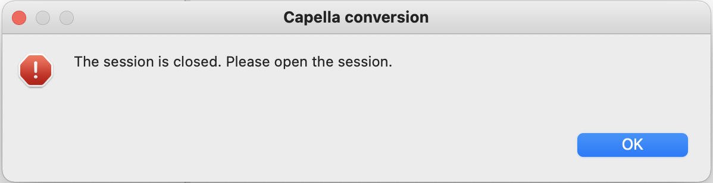

= CSV vers Capella

== Paramétrage

Pour importer un ensemble de fichiers CSV vers un modèle Capella, il suffit de faire un clic-droit sur un projet Capella et de sélectionner le menu *Capella Conversion > CSV to Capella*. 

Une boîte de dialogue s'ouvre alors, vous permettant de configurer l'import :

[width=400]

Les paramètres d'import sont :

* le répértoire d'import (_Import directory_) : répertoire qui va contenir les fichiers CSV à importer. Un message d'erreur s'affiche si le répertoire sélectionné n'existe pas.
* le délimiteur de champ (_Field delimiter_) : le délimiteur de champ utilisé dans les fichiers CSV. Chaque cellule d'un fichier CSV est séparée par un délimiteur spécifique, représenté par un caractère. Les valeurs les plus courantes sont le point-virgule, la virgule, l'espace et la tabulation. Le champ _Other:_ permet toutefois de définir le caractère de votre choix.
* le délimiteur de texte (_Text delimiter_) : le délimiteur de texte utilisé dans les fichiers CSV. Chaque cellule d'un fichier CSV est entourée par un délimiteur de texte, représenté par un caractère. Les valeurs possible sont les guillemets (_double quotation marks_), les guillemets simples (_single quotation marks_), ou aucun délimiteur (_none_).
* le jeu de caractères (_Character set_) : le jeu de caractères (i.e. encodage) utilisé pour les fichiers CSV. Les valeurs possibles sont windows-1252 (aussi connu sous le nom de _Cp1252_), UTF-8, ou ISO-8859-1 (aussi connu sous le nom de _Latin-1_).
* le séparateur de ligne (_Line separator_) : le séparateur de ligne utilisé dans les fichiers CSV. Les valeurs possibles sont le séparateur de ligne de Windows (_CRLF_), celui d'Unix (_LF_) ou celui du système d'exploitation sur lequel est exécuté l'import.

Tous ces paramètres ont pour valeur par défaut les valeurs définies dans les link:preferences.html[préférences].

Le bouton _Restore Defaults_ permet d'appliquer les valeurs par défaut.

Le bouton _Cancel_ permet d'annuler d'annuler le paramétrage de l'import (i.e. de fermer la boîte de dialogue).

Le bouton _Import_ permet d’exécuter l'import avec les paramètres définis.

Une fois le processus de conversion lancé, il est possible d'annuler la conversion en appuyant sur le bouton _Cancel_ :

[width=400]

=== Team for Capella

Si l'outil d'import est utilisé sur un projet Capella distant (Team for Capella), alors l'outil d'import va verrouiller l'ensemble des éléments du modèle avant de pouvoir faire l'import.
Il est en effet indispensable de verrouiller l'ensemble du modèle afin de garantir la cohérence des données importées (en évitant ainsi que les données soient modifiées en cours d'import par d'autre utilisateurs).

== Contenu des fichiers CSV

Un fichier CSV est nécessaire pour chaque type d’élément Capella à mettre à jour (création / mise à jour / suppression).
Son nom doit être de la forme _package.Element.csv_.
Pour vous aider à savoir quels sont les noms de packages et les types d'éléments, vous pouvez effectuer au choix un link:capellatocsv.html[export Capella vers CSV], ou une link:generate_empty_csv.html[génération de fichiers CSV vides].

Par exemple, le fichier CSV _la.LogicalFunction.csv_ doit contenir les _Logical Function_ que vous souhaitez créer, mettre à jour et supprimer.

Le contenu d'un fichier CSV ressemble à l'exemple suivant :

|===
|To create |Creation date |Creation time |To update |Last update date |Last update time |To delete |Deletion date |Deletion time |id |name |ownedLogicalFunctions |...

||20210408|11:56:53.736+02:00|x|20210408|11:56:53.736+02:00||||cc827db9-9cb3-4778-95cb-692951a8edfd|RootLogicalFunction|[2e54308e-bd8f-443d-9dbb-fba41f6c4bed, %NEW_TMP_ID%]|...
|x|||||||||%NEW_TMP_ID%|LogicalFunction 1||...
||20210408|11:56:53.736+02:00|x|20210409|14:33:21.194+02:00||||2e54308e-bd8f-443d-9dbb-fba41f6c4bed|LogicalFunction 2||...
||20200301|07:11:52.418+02:00||20210408|11:56:53.736+02:00|x|||3ab19f8e-ca2f-bbc1-87ee-e62acf5c4b3a|LogicalFunction 3||...
|===

Lors de l'import, les lignes dont les cellules _To create_ sont marquées d'une croix *x* seront considérées comme de nouveaux éléments à créer dans le modèle Capella.
Les lignes dont les cellules _To update_ sont marquées d'une croix *x* seront considérées comme des éléments existants à mettre à jour dans le modèle Capella.
Les lignes dont les cellules _To delete_ sont marquées d'une croix *x* seront considérées comme des éléments existants à supprimer dans le modèle Capella.

Les cellules _Creation date_, _Creation time_, Last update date_, _Last update time_, _Deletion date_ et _Deletion time_ sont ignorées lors de l'import.

Les cellules correspondantes à des références vers d'autres éléments contiennent les identifiants uniques des éléments référencés.
Si la référence a une cardinalité multiple (_0..*_), alors la liste des éléments référencés se fait sous la forme suivante : _[id, id, id, ...]_. 
Si la référence a une cardinalité simple (_0..1_), alors la liste des éléments référencés se fait sous la forme suivante : _id_. 

Les nouveaux éléments doivent avoir leur cellule *id* renseignée avec un identifiant temporaire unique de la forme suivante : *%NEW_TMP_ID%*.
Cet identifiant temporaire unique doit être utilisé dans les différentes cellules faisait référence à cet élément.
Par exemple dans l'exemple précédent, la fonction _RootLogicalFunction_ contient d'autres fonctions via la référence nommée _ownedLogicalFunctions_.
On souhaite ajouter notre nouvelle fonction _LogicalFunction 1_ à _RootLogicalFunction_. Il est donc *indispensable* d'ajouter l'identifiant unique de _LogicalFunction 1_ à la liste de fonctions de _RootLogicalFunction_ et de mettre une croix *x* dans la cellule _To update_ de _RootLogicalFunction_.

La présence des toutes les colonnes attributs et références n'est pas obligatoire. Les attributs et références inexistantes seront ignorées. Par exemple si la colonne correspondant à l'attribut _summary_ n'existe pas dans le fichier CSV, alors cet attribut sera ignoré lors de l'import.

=== Création / suppression / modification des composants Capella ===

La création des composants suivants (_LogicalComponent_, _PhysicalComponent_, _SystemComponent_, _ConfigurationItem_ et _Entity_) engendre un comportement particulier dans Capella. En effet, lorsque ces types d'éléments sont crées, un autre type d'élément est crée dans le même temps : la _Part_.
Lors d'un import CSV vers Capella, il sera donc la plupart du temps nécessaire de créer des _Parts_ en même temps que l'on crée un des composants cités ci-avant.

Voici un exemple de fichiers CSVs simulant l'ajout de _LogicalComponents_ et de leur _Parts_ associées :

_la.LogicalFunction.csv_ :

|===
|To create |Creation date |Creation time |To update |Last update date |Last update time |To delete |Deletion date |Deletion time |id |name |ownedLogicalComponents |ownedFeatures |...

||20210408|11:56:53.736+02:00|x|20210408|11:56:53.736+02:00||||cc827db9-9cb3-4778-95cb-692951a8edfd|Logical System|[%NEW_LC1%, %NEW_LC2%]|[%NEW_PART_LC1%, %NEW_PART_LC2%]|...
|x|||||||||%NEW_LC1%|LC 1|||...
|x|||||||||%NEW_LC2%|LC 2|||...
|===

_cs.Part.csv_ :

|===
|To create |Creation date |Creation time |To update |Last update date |Last update time |To delete |Deletion date |Deletion time |id |name |abstractType |...

|x|||||||||%NEW_PART_LC1%|LC 1|%NEW_LC1%|...
|x|||||||||%NEW_PART_LC2%|LC 2|%NEW_LC2%|...
|===

Les _Parts_ nouvellement crées doivent être reliées à leur composants respectifs via la référence _abstractType_.
Les _Parts_ nouvellement crées doivent être contenues par le même composant que celui contenant les nouveaux composants, via la référence _ownedFeatures_.
Dans l'exemple ci-dessus, les nouveaux composants _LC 1_ et _LC 2_ sont contenus par le composant parent _Logical System_. Les deux nouvelles _Parts_ doivent alors être également contenues par le composant _Logical System_.

Sur le même principe, il sera donc la plupart du temps nécessaire de supprimer une _Part_ lorsque l'on supprime un composant _LogicalComponent_, _PhysicalComponent_, _SystemComponent_, _ConfigurationItem_ ou _Entity_.

Sur le même principe, il sera donc la plupart du temps nécessaire de renommer une _Part_ lorsque l'on renomme un composant _LogicalComponent_, _PhysicalComponent_, _SystemComponent_, _ConfigurationItem_ ou _Entity_.
En effet, les deux noms sont souvent identiques, bien qu'il n'y ait pas d'obligation.

== Résultat d'import

Suite à un import réussi, le modèle Capella associé au projet est mis à jour.
Un export Capella vers CSV est ensuite automatiquement effectué dans le répertoire d'import.
Afin de ne pas modifier les fichiers CSV ayant servi à l'import, les fichiers CSV sont exportés dans un sous-dossier nommé _after_.
Le contenu de ce sous-dossier est supprimé au début de chaque nouvel import.

Si une erreur survient pendant l'opération d'import, le processus est annulé et le modèle Capella n'est pas modifié.
Un message d'erreur s'affiche alors pour informer du type d'erreur (voir section <<Messages d'erreurs>> pour plus de détails).

=== Team for Capella

Si l'outil d'import est utilisé sur un projet Capella distant (Team for Capella), alors l'outil d'import va déverrouiller l'ensemble des éléments du modèle après l'import.

== Messages d'erreurs

Tous les messages d'erreurs suivants entraînent une annulation de l'import.

=== Session fermée

L'import ne peut fonctionner que si la *session Capella est ouverte*, auquel cas un message d'erreur apparaîtra :

[width=450]

Pour ouvrir la session Capella, veuillez double cliquer sur le fichier *.aird* contenu dans le projet.

=== Colonne ne correspondant à aucun attribut ou référence

L'import échoue si une colonne ne correspond pas à un attribut ou une référence du type d'élément Capella concerné.
Dans ce cas, un message d'erreur s'affiche indiquant le fichier et la colonne concernés.

[width=450]

=== Erreur de lecture du fichier CSV

L'import échoue si la lecture du fichier CSV ne peut se faire (fichier ne respectant pas les normes CSV).
Dans ce cas, un message d'erreur s'affiche indiquant le fichier et la ligne concernés.

[width=450]
image::images/csvtocapella_parsing_error.png[Erreur de lecture du fichier CSV]

=== Mauvais ID temporaire

L'import échoue si l'identifiant unique temporaire associé à un nouvel élément ne respecte pas le format _%NEW_TMP_ID%_ ou est absent.
Dans ce cas, un message d'erreur s'affiche indiquant le fichier et l'identifiant concernés.

[width=450]

=== Nom de fichier erroné

L'import échoue si un des fichiers CSV ne correspond à aucun type d'élément Capella.
Dans ce cas, un message d'erreur s'affiche indiquant le fichier concerné.

[width=450]

=== Ajout d'une valeur avec le mauvais type dans une cellule 

L'import échoue si une cellule d'un fichiers CSV contient une valeur dont le type n'est pas compatible avec celui du type de la cellule.
Par exemple, Une _SystemFunction_ possède une référence nommée _ownedFunctionRealizations_ qui contient des éléments de type _FunctionRealization_.
Si un utilisateur essaie d'insérer un élément de type _SystemFunction_, un message d'erreur s'affiche indiquant le fichier concerné, la ligne, ainsi que la référence, et le mauvais type d'élément qui a échoué à être ajouté.

[width=450]
image::images/csvtocapella_classcast.png[Mauvais type dans une cellule]

=== Team for Capella : éléments vérouillés par d'autres utilisateurs

Si l'outil d'import est utilisé sur un projet Capella distant (Team for Capella), alors l'outil d'import va verrouiller l'ensemble des éléments du modèle avant de pouvoir faire l'import.
Si cette étape échoue, car d'autres utilisateurs verrouillent déjà des éléments, alors un message d'erreur s'affichera pour indiquer quels éléments sont verrouillés et par qui :

[width=500]
image::images/team4capella_lockbyother.png[Team for Capella]

== Messages d'information

Lors de l'import, l'utilisateur peut ajouter des nouveaux éléments (via une croix *x* dans la cellule _To Create_), mais il peut oublier de les ajouter à une (des) référence(s) de contenance (via une croix *x* dans la cellule _To Update_ correspondante).
Dans ce cas précis, l'import n'échoue pas, mais un message d'information est affiché à la fin du processus d'import, indiquant quels éléments n'ont pas été importés.

[width=450]

