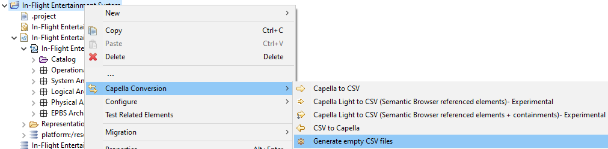
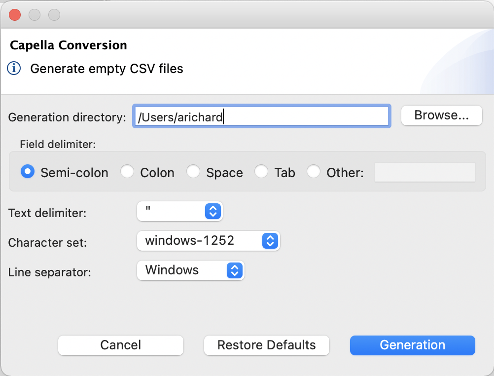
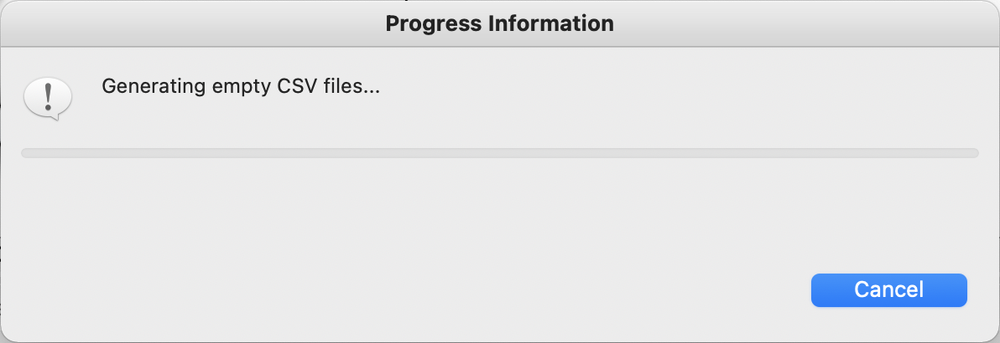

= Génération de fichiers CSV vides

== Paramétrage

Il n'est pas forcément évident de connaître l'ensemble des concepts (type d'éléments) Capella, ainsi que les attributs et références de ces concepts.

Pour aider, il est possible de générer un ensemble de fichiers CSV, 1 pour chaque concept Capella, chacun contenant l'ensemble des attributs et références associés à ces concepts.

Pour générer ces fichiers, il suffit de faire un clic-droit sur un projet Capella et de sélectionner le menu *Capella Conversion > Generate empty CSV files*. 

Une boîte de dialogue s'ouvre alors, vous permettant de configurer la génération :

[width=400]

Les paramètres de génération sont :

* le répertoire de génération (_Generation directory_) : répertoire qui va contenir les fichiers CSV suite à la génération. Un message d'erreur s'affiche si le répertoire sélectionné n'existe pas.
* le délimiteur de champ (_Field delimiter_) : chaque cellule d'un fichier CSV est séparée par un délimiteur spécifique, représenté par un caractère. Les valeurs les plus courantes sont le point-virgule, la virgule, l'espace et la tabulation. Le champ _Other:_ permet toutefois de définir le caractère de votre choix.
* le délimiteur de texte (_Text delimiter_) : chaque cellule d'un fichier CSV est entourée par un délimiteur de texte, représenté par un caractère. Les valeurs possible sont les guillemets (_double quotation marks_), les guillemets simples (_single quotation marks_), ou aucun délimiteur (_none_).
* le jeu de caractères (_Character set_) : le jeu de caractères (i.e. encodage) à utiliser pour les fichiers CSV. Les valeurs possibles sont windows-1252 (aussi connu sous le nom de _Cp1252_), UTF-8, ou ISO-8859-1 (aussi connu sous le nom de _Latin-1_).
* le séparateur de ligne (_Line separator_) : le séparateur de ligne à utiliser dans les fichiers CSV. Les valeurs possibles sont le séparateur de ligne de Windows (_CRLF_), celui d'Unix (_LF_) ou celui du système d'exploitation sur lequel est exécuté la génération.

Tous ces paramètres ont pour valeur par défaut les valeurs définies dans les link:preferences.html[préférences].

Le bouton _Restore Defaults_ permet d'appliquer les valeurs par défaut.

Le bouton _Cancel_ permet d'annuler le paramétrage de la génération (i.e. de fermer la boîte de dialogue).

Le bouton _Generate_ permet d’exécuter la génération avec les paramètres définis.

Une fois le processus de génération lancé, il est possible d'annuler la génération en appuyant sur le bouton _Cancel_ :

[width=400]

== Résultat de la génération

Suite à la génération, un ensemble de fichiers CSV est crée (ou écrasé) dans le répertoire de génération.
Un fichier CSV est crée (ou écrasé) pour tous les types d’éléments Capella (présents dans le modèle d'entrée ou non).