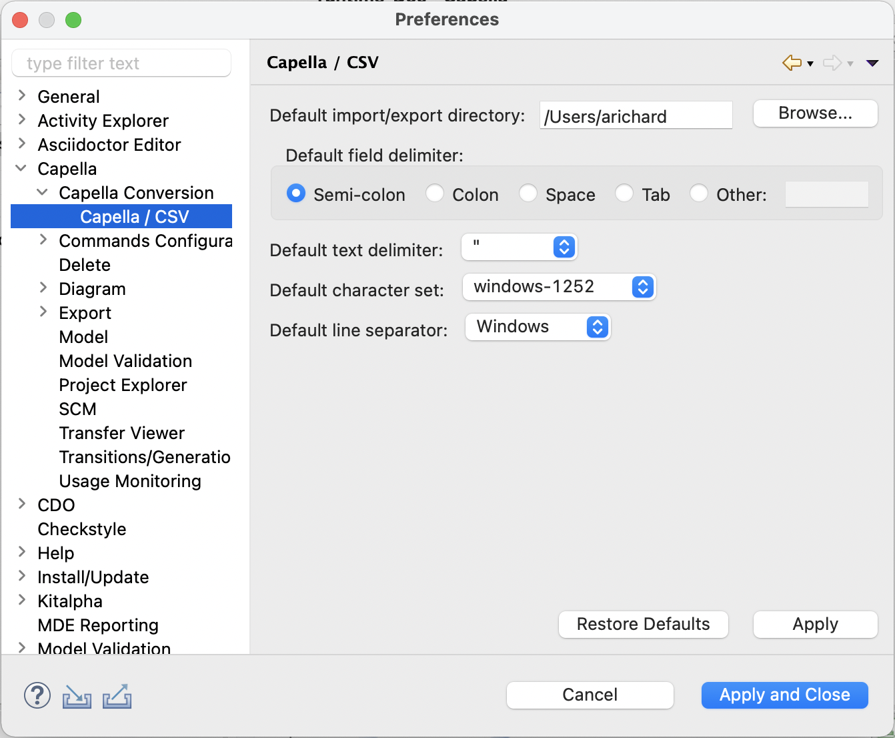

= Préférences

Les préférences de conversion sont accessibles via le menu *Window > Preferences... > Capella > Capella Conversion > Capella / CSV* : 

[width=500]

Les paramètres de conversion sont :

* le répertoire d'import (_Import directory_) : répertoire qui va contenir les fichiers CSV à importer/exporter. Un message d'erreur s'affiche si le répertoire sélectionné n'existe pas.
* le délimiteur de champ (_Field delimiter_) : le délimiteur de champ utilisé dans les fichiers CSV. Chaque cellule d'un fichier CSV est séparée par un délimiteur spécifique, représenté par un caractère. Les valeurs les plus courantes sont le point-virgule, la virgule, l'espace et la tabulation. Le champ _Other:_ permet toutefois de définir le caractère de votre choix.
* le délimiteur de texte (_Text delimiter_) : le délimiteur de texte utilisé dans les fichiers CSV. Chaque cellule d'un fichier CSV est entourée par un délimiteur de texte, représenté par un caractère. Les valeurs possible sont les guillemets (_double quotation marks_), les guillemets simples (_single quotation marks_), ou aucun délimiteur (_none_).
* le jeu de caractères (_Character set_) : le jeu de caractères (i.e. encodage) utilisé pour les fichiers CSV. Les valeurs possibles sont windows-1252 (aussi connu sous le nom de _Cp1252_), UTF-8, ou ISO-8859-1 (aussi connu sous le nom de _Latin-1_).
* le séparateur de ligne (_Line separator_) : le séparateur de ligne utilisé dans les fichiers CSV. Les valeurs possibles sont le séparateur de ligne de Windows (_CRLF_), celui d'Unix (_LF_) ou celui du système d'exploitation sur lequel est exécuté l'import.

Ces valeurs par défaut sont utilisées à la fois pour la conversion link:capellatocsv.html[Capella vers CSV], la conversion link:csvtocapella.html[CSV vers Capella] et la link:generate_empty_csv.html[génération des fichiers CSV vides].

Ces valeurs par défaut sont appliquées à tous les projets Capella.

Les valeurs par défaut de ces paramètres sont :

* le répertoire d'import (_Import directory_) : le répertoire utilisateur (valeur de la variable d'environnement _%HOMEPATH%_ sous Windows, correspond généralement à _C:\Users\MyAccount_).
* le délimiteur de champ (_Field delimiter_) : le point-virgule.
* le délimiteur de texte (_Text delimiter_) : les guillemets (_double quotation marks_).
* le jeu de caractères (_Character set_) : windows-1252 (aussi connu sous le nom de _Cp1252_).
* le séparateur de ligne (_Line separator_) : le séparateur de ligne de Windows (_CRLF_).

Le bouton _Restore Defaults_ permet de restaurer les valeurs par défaut initiales (celles présentes à l'installation de l'add-on de conversion).

Le bouton _Apply_ permet d'appliquer les valeurs sélectionnées en tant que nouvelles valeurs par défaut.

Le bouton _Cancel_ permet de fermer la boîte de dialogue des préférences sans appliquer les changements.

Le bouton _Apply and Close_ permet d'appliquer les valeurs sélectionnées en tant que nouvelles valeurs par défaut et de fermer la boîte de dialogue des préférences.